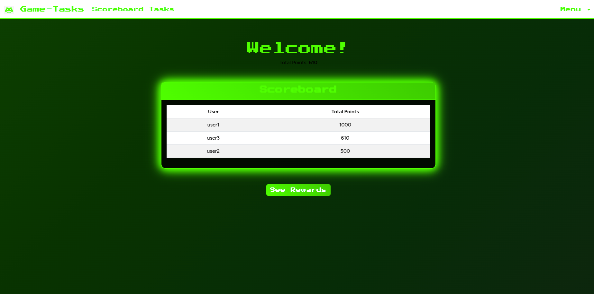

# Gamify Tasks App 🎮✅

Gamify Tasks is a simple app that makes productivity fun by turning goal-setting into a competitive experience. Track your progress and stay motivated as you complete tasks and achieve your goals!

## 🚀 Features
- ✅ **Task management** - Create, edit, and track your tasks easily.
- 🎯 **Gamification** - Earn points and badges as you complete tasks.
- 🏆 **Leaderboard** - Compete with other users for the top spot. 

## 🛠️ Technologies Used
- **Backend**: Laravel (PHP)
- **Frontend**: Blade Templates
- **Database**: MySQL

## 📌 Contributing
Feel free to contribute! Fork the repo, make changes, and submit a PR.